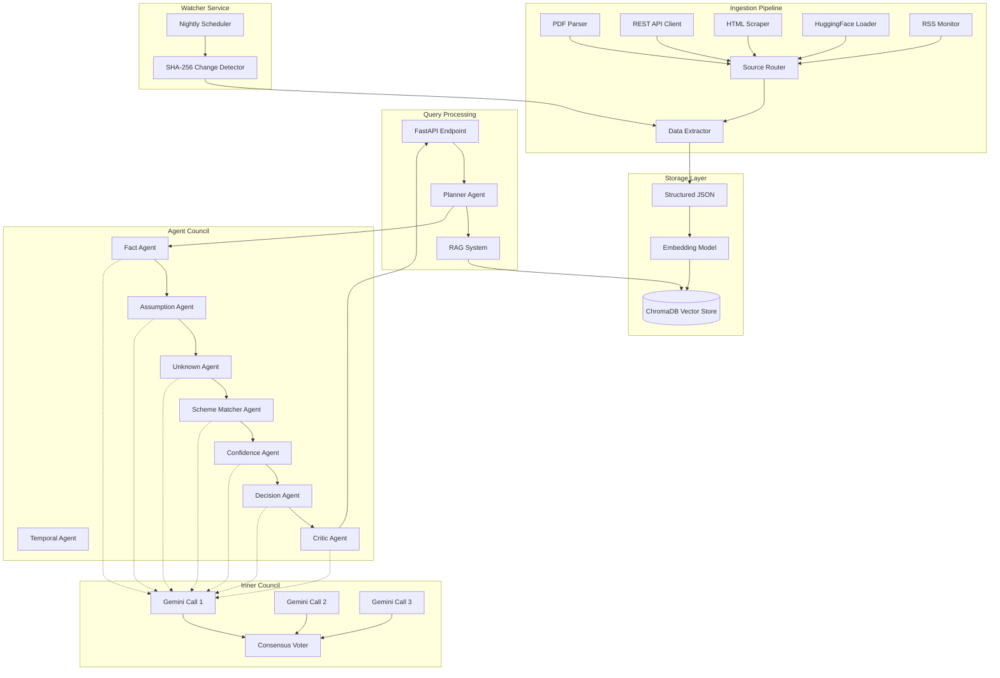

# UFAC Engine Design Document

## Overview

The UFAC Engine (Uncertainty-First Agent Council) is a sophisticated multi-agent AI system designed to help Indian citizens discover and assess eligibility for central government agriculture schemes. The system's core philosophy is transparency through uncertainty - explicitly surfacing gaps, assumptions, and missing information rather than providing false confidence.

### System Architecture

The UFAC Engine consists of five major subsystems:

1. **Ingestion Pipeline**: Multi-source data ingestion (PDF, REST API, HTML, HuggingFace, RSS) with unified JSON schema conversion
2. **Vector Store & RAG System**: ChromaDB-based semantic search with metadata filtering for scheme retrieval
3. **Agent Orchestration Layer**: 9 specialized agents coordinated by a planner, each with inner LLM council consensus voting
4. **Watcher Service**: Nightly monitoring service with SHA-256 change detection for scheme updates
5. **REST API Layer**: FastAPI-based query interface with rate limiting and error handling

### Key Design Principles

- **Uncertainty-First**: Explicitly surface unknowns, assumptions, and confidence levels
- **Consensus-Based Reliability**: Each agent uses 3 parallel Gemini calls with majority voting
- **Metadata-Aware Retrieval**: RAG system filters by state, income, land size before semantic search
- **Temporal Awareness**: Track scheme versions and detect recent changes
- **Graceful Degradation**: Continue processing even if individual agents fail


## Architecture

### High-Level System Flow



### Component Responsibilities

#### Ingestion Pipeline

**Source Router**: Determines the appropriate parser based on source type (PDF, API, HTML, HF, RSS)

**PDF Parser**: 
- Primary: pymupdf for text extraction
- Fallback: pdfplumber for complex layouts
- Detects scanned PDFs requiring OCR
- Preserves table structures

**REST API Client**:
- Queries myscheme.gov.in and data.gov.in APIs
- Implements exponential backoff retry (3 attempts)
- Validates JSON responses

**HTML Scraper**:
- Uses beautifulsoup4 for content extraction
- Removes navigation, headers, footers, ads
- Preserves scheme titles, descriptions, eligibility, links
- Flags JavaScript-rendered pages

**HuggingFace Loader**:
- Loads shrijayan/gov_myscheme dataset
- Filters for agriculture-related schemes
- Retries on download failure (3 attempts)

**RSS Monitor**:
- Fetches PIB agriculture RSS feed
- Filters by keywords: scheme, agriculture, farmer, PM-KISAN, PMFBY
- Extracts announcement text

**Data Extractor**:
- Converts all source formats to unified JSON schema
- Validates against schema
- Assigns unique scheme_id
- Adds metadata: source_type, timestamp, document_hash


#### Vector Store & RAG System

**Embedding Model**:
- Generates vector embeddings from scheme text
- Chunks long documents into 512-token segments
- Preserves document structure in metadata

**ChromaDB Vector Store**:
- Stores embeddings with metadata: state, scheme_type, income_range, land_range
- Supports metadata filtering before semantic search
- Persists to disk for recovery
- Maintains version history for temporal queries

**RAG System**:
- Generates search queries from User_Profile
- Retrieves top-10 semantically similar chunks
- Applies metadata filters: state, income, land size
- Returns chunks with similarity > 0.6
- Broadens search if < 3 chunks retrieved
- Combines semantic similarity with metadata match scores

#### Agent Orchestration

**Planner Agent**:
- Extracts User_Profile from natural language query (English/Hindi)
- Normalizes values (e.g., "5 acres" → 5.0, "Uttar Pradesh" → "UP")
- Routes to appropriate specialized agents
- Executes agents in dependency order: Fact → Assumption → Unknown → Scheme_Matcher → Confidence → Decision
- Passes outputs between agents

**Fact Agent**:
- Extracts explicitly stated facts from User_Profile
- Distinguishes stated vs inferred facts
- Returns facts with source references
- Flags contradictions between user facts and scheme requirements

**Assumption Agent**:
- Identifies implicit assumptions in eligibility assessment
- Categorizes: demographic, geographic, temporal, financial
- Returns assumptions with explanations
- Flags high-risk assumptions

**Unknown Agent**:
- Identifies missing required fields
- Categorizes by priority: critical, important, optional
- Returns missing info with explanations
- Triggers additional RAG queries for alternative schemes when critical info missing

**Temporal Agent**:
- Checks for multiple scheme versions in Vector_Store
- Identifies most recent version by ingestion_timestamp
- Flags schemes revised within 90 days
- Returns revision dates and change summaries

**Scheme Matcher Agent**:
- Calculates eligibility score (0-100) per scheme
- Bases score on: matching criteria count, missing criteria severity, profile completeness
- Returns schemes ranked by score (descending)
- Includes per-criterion match status: met, not met, unknown

**Confidence Agent**:
- Calculates calibrated confidence score (0-100) per recommendation
- Bases confidence on: profile completeness, document clarity, inner council agreement, RAG similarity
- Reduces confidence by 20 points per critical missing field
- Reduces confidence by 10 points per high-risk assumption
- Returns confidence with explanatory factors

**Decision Agent**:
- Generates prioritized next steps per scheme
- Includes: gather documents, visit portals, contact offices, verify eligibility
- Provides Portal_Links for online applications
- Estimates time per step
- Sequences steps logically

**Critic Agent**:
- Reviews all agent outputs for consistency
- Verifies confidence scores align with unknowns/assumptions
- Checks for logical contradictions
- Sets Safety_Flag for concerning recommendations (e.g., high confidence + ineligible)
- Approves final output or requests agent re-processing


#### Inner LLM Council

Each specialized agent (Fact, Assumption, Unknown, Temporal, Scheme_Matcher, Confidence, Decision, Critic) implements the Inner Council pattern:

1. **Parallel Execution**: Makes 3 simultaneous calls to Gemini API with identical prompts
2. **Response Collection**: Gathers all 3 responses
3. **Consensus Voting**: 
   - If 2+ responses agree → select that response
   - If all 3 differ → select response with highest confidence score
4. **Disagreement Logging**: Logs all disagreements for monitoring and improvement

This pattern increases reliability by reducing single-model errors and hallucinations.

#### Watcher Service

**Nightly Scheduler**:
- Runs at 02:00 IST daily
- Checks all configured government portal URLs
- Triggers change detection

**SHA-256 Change Detector**:
- Calculates document hashes
- Compares with stored hashes
- Triggers re-ingestion on hash mismatch
- Compares old vs new versions
- Identifies changed sections: eligibility, benefits, application process, deadlines
- Generates change summaries with before/after snippets
- Flags critical changes (eligibility tightened, scheme discontinued)
- Stores change history with temporal metadata

**Re-ingestion Process**:
- Processes only changed documents
- Updates Vector_Store with new embeddings
- Preserves scheme_id, increments version_number
- Archives old versions (retained for temporal queries)
- Completes within 5 minutes per document

#### REST API Layer

**FastAPI Endpoint**: POST /api/v1/query

**Request Validation**:
- Accepts JSON: `{"user_query": "string"}`
- Returns 400 for invalid requests

**Rate Limiting**: 10 requests/minute per IP

**Processing**:
- Invokes UFAC_Engine
- Returns structured JSON response
- 95th percentile response time: < 10 seconds

**Error Handling**:
- Gemini API unavailable → 503 "AI service temporarily unavailable"
- Vector_Store unavailable → 503 "Database temporarily unavailable"
- Query timeout (30s) → 504 "Query processing timeout"
- Agent exception → log error, continue with remaining agents
- Never expose internal errors or stack traces

**Logging**:
- All queries with timestamps and response times
- Structured JSON log files with daily rotation


## Components and Interfaces

### Ingestion Module Interface

```python
class IngestionModule:
    """Orchestrates multi-source scheme data ingestion"""
    
    def ingest_pdf(self, source: str) -> StructuredScheme:
        """Ingest from PDF file path or URL"""
        
    def ingest_api(self, endpoint: str) -> List[StructuredScheme]:
        """Ingest from REST API endpoint"""
        
    def ingest_html(self, url: str) -> StructuredScheme:
        """Ingest from HTML page"""
        
    def ingest_huggingface(self, dataset_name: str) -> List[StructuredScheme]:
        """Ingest from HuggingFace dataset"""
        
    def ingest_rss(self, feed_url: str) -> List[StructuredScheme]:
        """Ingest from RSS feed"""
        
    def validate_schema(self, data: dict) -> bool:
        """Validate against unified JSON schema"""
        
    def pretty_print(self, scheme: StructuredScheme) -> str:
        """Export scheme in human-readable format"""
```

### PDF Parser Interface

```python
class PDFParser:
    """Robust PDF text extraction with fallback"""
    
    def parse(self, source: str) -> ParsedDocument:
        """
        Parse PDF from file path or URL
        - Primary: pymupdf
        - Fallback: pdfplumber if < 100 chars extracted
        - Detects scanned PDFs
        - Preserves table structures
        """
        
    def extract_tables(self, pdf_path: str) -> List[Table]:
        """Extract tables as structured data"""
        
    def is_scanned(self, pdf_path: str) -> bool:
        """Detect if PDF requires OCR"""
```

### Vector Store Interface

```python
class VectorStore:
    """ChromaDB wrapper with metadata filtering"""
    
    def add_scheme(self, scheme: StructuredScheme, embeddings: List[float]) -> str:
        """Add scheme with embeddings and metadata"""
        
    def query(
        self, 
        query_embedding: List[float], 
        filters: MetadataFilters,
        top_k: int = 10,
        min_similarity: float = 0.6
    ) -> List[SchemeChunk]:
        """Retrieve top-k chunks with metadata filtering"""
        
    def get_versions(self, scheme_id: str) -> List[SchemeVersion]:
        """Get all versions of a scheme for temporal queries"""
        
    def archive_version(self, scheme_id: str, version: int) -> None:
        """Mark version as archived but retain for history"""
        
    def persist(self) -> None:
        """Persist to disk"""
```

### RAG System Interface

```python
class RAGSystem:
    """Retrieval-Augmented Generation system"""
    
    def retrieve(
        self, 
        user_profile: UserProfile, 
        top_k: int = 10
    ) -> List[SchemeChunk]:
        """
        Generate search query from profile
        Apply metadata filters
        Retrieve semantically similar chunks
        Broaden search if < 3 chunks found
        """
        
    def generate_query(self, profile: UserProfile) -> str:
        """Convert user profile to search query"""
        
    def apply_filters(self, profile: UserProfile) -> MetadataFilters:
        """Build metadata filters from profile"""
        
    def rank_results(
        self, 
        chunks: List[SchemeChunk], 
        semantic_scores: List[float],
        metadata_matches: List[float]
    ) -> List[SchemeChunk]:
        """Combine semantic and metadata scores for ranking"""
```


### Agent Base Interface

```python
class BaseAgent(ABC):
    """Base class for all specialized agents"""
    
    def __init__(self, gemini_client: GeminiClient):
        self.gemini_client = gemini_client
        self.inner_council = InnerCouncil(gemini_client)
    
    @abstractmethod
    def process(self, input_data: dict) -> dict:
        """Process input and return output"""
        
    def invoke_with_consensus(self, prompt: str) -> str:
        """
        Make 3 parallel Gemini calls
        Vote on consensus
        Log disagreements
        """
        return self.inner_council.vote(prompt)
```

### Specialized Agent Interfaces

```python
class PlannerAgent(BaseAgent):
    def extract_profile(self, query: str) -> UserProfile:
        """Extract and normalize user profile from query"""
        
    def route_agents(self, query_type: str) -> List[str]:
        """Determine which agents to invoke"""

class FactAgent(BaseAgent):
    def extract_facts(self, profile: UserProfile, schemes: List[SchemeChunk]) -> List[Fact]:
        """Extract confirmed facts with sources"""

class AssumptionAgent(BaseAgent):
    def identify_assumptions(self, profile: UserProfile, schemes: List[SchemeChunk]) -> List[Assumption]:
        """Identify implicit assumptions with categories"""

class UnknownAgent(BaseAgent):
    def identify_missing(self, profile: UserProfile, schemes: List[SchemeChunk]) -> List[MissingInfo]:
        """Identify missing information by priority"""
        
    def trigger_additional_retrieval(self, missing: List[MissingInfo]) -> bool:
        """Determine if additional RAG query needed"""

class TemporalAgent(BaseAgent):
    def check_revisions(self, schemes: List[SchemeChunk]) -> List[Revision]:
        """Check for scheme revisions within 90 days"""

class SchemeMatcherAgent(BaseAgent):
    def score_eligibility(self, profile: UserProfile, schemes: List[SchemeChunk]) -> List[SchemeMatch]:
        """Calculate eligibility scores (0-100) and rank"""

class ConfidenceAgent(BaseAgent):
    def calculate_confidence(
        self, 
        matches: List[SchemeMatch],
        missing: List[MissingInfo],
        assumptions: List[Assumption],
        council_agreement: float,
        rag_similarity: float
    ) -> List[ConfidenceScore]:
        """Calculate calibrated confidence scores"""

class DecisionAgent(BaseAgent):
    def generate_next_steps(self, matches: List[SchemeMatch]) -> List[NextSteps]:
        """Generate prioritized, sequenced action steps"""

class CriticAgent(BaseAgent):
    def review(self, all_outputs: dict) -> ReviewResult:
        """
        Review for consistency
        Verify confidence alignment
        Check contradictions
        Set safety flags
        Approve or request re-processing
        """
```

### Inner Council Interface

```python
class InnerCouncil:
    """Implements consensus voting across 3 Gemini calls"""
    
    def __init__(self, gemini_client: GeminiClient):
        self.client = gemini_client
        
    def vote(self, prompt: str) -> str:
        """
        Make 3 parallel calls
        Collect responses
        Apply majority voting
        If all differ, select highest confidence
        Log disagreements
        """
        
    def _parallel_calls(self, prompt: str) -> List[str]:
        """Execute 3 parallel Gemini API calls"""
        
    def _majority_vote(self, responses: List[str]) -> str:
        """Apply consensus voting logic"""
        
    def _log_disagreement(self, responses: List[str], selected: str) -> None:
        """Log when council members disagree"""
```


### Watcher Service Interface

```python
class WatcherService:
    """Nightly monitoring service for scheme updates"""
    
    def __init__(self, scheduler: Scheduler, change_detector: ChangeDetector):
        self.scheduler = scheduler
        self.change_detector = change_detector
        
    def start(self) -> None:
        """Start nightly scheduler at 02:00 IST"""
        
    def check_portals(self, portal_urls: List[str]) -> List[Change]:
        """Check all configured portals for changes"""

class ChangeDetector:
    """SHA-256 based change detection"""
    
    def calculate_hash(self, document: str) -> str:
        """Calculate SHA-256 hash of document"""
        
    def detect_changes(self, scheme_id: str, new_hash: str) -> Optional[Change]:
        """Compare new hash with stored hash"""
        
    def compare_versions(self, old_doc: str, new_doc: str) -> ChangeReport:
        """
        Identify changed sections
        Generate before/after snippets
        Flag critical changes
        """
        
    def store_change_history(self, change: Change) -> None:
        """Store change with temporal metadata"""
```

### REST API Interface

```python
from fastapi import FastAPI, HTTPException, Request
from pydantic import BaseModel

app = FastAPI()

class QueryRequest(BaseModel):
    user_query: str

class QueryResponse(BaseModel):
    matched_schemes: List[SchemeMatch]
    confidence_scores: List[ConfidenceScore]
    safety_flags: List[SafetyFlag]
    unknowns: List[MissingInfo]
    assumptions: List[Assumption]
    next_steps: List[NextSteps]
    portal_links: List[str]
    response_metadata: ResponseMetadata

@app.post("/api/v1/query")
async def query_schemes(request: QueryRequest, req: Request) -> QueryResponse:
    """
    Process user query through UFAC Engine
    - Validate input
    - Apply rate limiting (10 req/min per IP)
    - Invoke engine
    - Handle errors gracefully
    - Return structured response
    """

@app.middleware("http")
async def rate_limit_middleware(request: Request, call_next):
    """Implement 10 requests/minute per IP rate limiting"""

@app.exception_handler(Exception)
async def global_exception_handler(request: Request, exc: Exception):
    """
    Handle all exceptions gracefully
    - Never expose internal errors
    - Return appropriate HTTP status codes
    - Log errors for debugging
    """
```


## Data Models

### Core Data Structures

```python
from pydantic import BaseModel, Field
from typing import Optional, List, Literal
from datetime import datetime
from enum import Enum

class SourceType(str, Enum):
    PDF = "pdf"
    API = "api"
    HTML = "html"
    HUGGINGFACE = "huggingface"
    RSS = "rss"

class StructuredScheme(BaseModel):
    """Unified JSON schema for all ingested schemes"""
    scheme_id: str = Field(description="Unique identifier")
    scheme_name: str
    description: str
    eligibility_criteria: List[str]
    benefits: List[str]
    application_process: str
    portal_link: Optional[str] = None
    state_specific: Optional[str] = None  # State code or "nationwide"
    income_limit: Optional[float] = None  # In INR, null = no limit
    land_requirement: Optional[float] = None  # In acres, null = no requirement
    occupation_requirement: Optional[List[str]] = None
    version_number: int = 1
    is_archived: bool = False
    
    # Metadata
    source_type: SourceType
    source_url: Optional[str] = None
    api_endpoint: Optional[str] = None
    ingestion_timestamp: datetime
    document_hash: str

class UserProfile(BaseModel):
    """Extracted user information from query"""
    occupation: Optional[str] = None
    land_size: Optional[float] = None  # In acres
    state: Optional[str] = None  # State code
    district: Optional[str] = None
    income: Optional[float] = None  # Annual income in INR
    age: Optional[int] = None
    gender: Optional[str] = None
    caste_category: Optional[str] = None  # General, SC, ST, OBC

class SchemeChunk(BaseModel):
    """Embedded text segment from scheme document"""
    chunk_id: str
    scheme_id: str
    text: str
    embedding: List[float]
    similarity_score: float = 0.0
    metadata: dict  # state, scheme_type, income_range, land_range

class MetadataFilters(BaseModel):
    """Filters for RAG retrieval"""
    state: Optional[str] = None
    income_max: Optional[float] = None
    land_max: Optional[float] = None
    land_min: Optional[float] = None
    scheme_type: Optional[str] = None

class Fact(BaseModel):
    """Confirmed fact from user query or scheme document"""
    fact_text: str
    source: Literal["user_query", "scheme_document"]
    source_reference: str  # Quote or document ID
    is_contradiction: bool = False

class Assumption(BaseModel):
    """Implicit assumption made during assessment"""
    assumption_text: str
    category: Literal["demographic", "geographic", "temporal", "financial"]
    explanation: str
    is_high_risk: bool = False

class MissingInfo(BaseModel):
    """Missing information needed for assessment"""
    field_name: str
    priority: Literal["critical", "important", "optional"]
    explanation: str
    example_value: Optional[str] = None

class Revision(BaseModel):
    """Scheme revision information"""
    scheme_id: str
    old_version: int
    new_version: int
    revision_date: datetime
    is_recent: bool  # Within 90 days
    change_summary: Optional[str] = None
    changed_sections: List[str]

class SchemeMatch(BaseModel):
    """Eligibility assessment for a scheme"""
    scheme_id: str
    scheme_name: str
    eligibility_score: int = Field(ge=0, le=100)
    criteria_status: dict  # {criterion: "met" | "not_met" | "unknown"}
    portal_link: Optional[str] = None

class ConfidenceScore(BaseModel):
    """Calibrated confidence in recommendation"""
    scheme_id: str
    confidence: int = Field(ge=0, le=100)
    factors: dict  # Factors affecting confidence
    explanation: str

class NextSteps(BaseModel):
    """Actionable steps for scheme application"""
    scheme_id: str
    steps: List[str]
    estimated_time_minutes: int
    portal_link: Optional[str] = None

class SafetyFlag(BaseModel):
    """Warning for potentially incorrect recommendation"""
    scheme_id: str
    flag_type: str
    description: str
    severity: Literal["low", "medium", "high"]

class ResponseMetadata(BaseModel):
    """Metadata about query processing"""
    query_timestamp: datetime
    processing_time_ms: int
    agents_invoked: List[str]
    rag_chunks_retrieved: int
    inner_council_disagreements: int
```


### Change Detection Models

```python
class Change(BaseModel):
    """Detected change in scheme document"""
    scheme_id: str
    old_hash: str
    new_hash: str
    detection_timestamp: datetime
    requires_reingestion: bool = True

class ChangeReport(BaseModel):
    """Detailed comparison of document versions"""
    scheme_id: str
    old_version: int
    new_version: int
    changed_sections: List[str]  # eligibility, benefits, application_process, deadlines
    before_snippets: dict  # {section: text}
    after_snippets: dict  # {section: text}
    is_critical: bool  # Eligibility tightened or scheme discontinued
    summary: str

class SchemeVersion(BaseModel):
    """Historical version of a scheme"""
    scheme_id: str
    version_number: int
    scheme_data: StructuredScheme
    valid_from: datetime
    valid_until: Optional[datetime] = None
    is_current: bool = False
```

### Logging Models

```python
class AgentLog(BaseModel):
    """Log entry for agent invocation"""
    agent_name: str
    input_data: dict
    output_data: dict
    processing_time_ms: int
    timestamp: datetime

class CouncilLog(BaseModel):
    """Log entry for inner council voting"""
    agent_name: str
    prompt: str
    responses: List[str]
    votes: dict  # {response: count}
    selected_response: str
    had_disagreement: bool
    timestamp: datetime

class RAGLog(BaseModel):
    """Log entry for RAG retrieval"""
    query: str
    retrieved_chunks: int
    similarity_scores: List[float]
    metadata_filters: MetadataFilters
    timestamp: datetime

class CriticLog(BaseModel):
    """Log entry for critic review"""
    issues_found: List[str]
    corrections_made: List[str]
    final_confidence_adjustments: dict  # {scheme_id: adjustment}
    safety_flags_added: List[SafetyFlag]
    approved: bool
    timestamp: datetime
```

### Configuration Models

```python
class SystemConfig(BaseModel):
    """System configuration"""
    gemini_api_key: str
    vector_store_path: str
    log_directory: str
    portal_urls: List[str]
    watcher_schedule: str = "0 2 * * *"  # Cron format: 02:00 daily
    rate_limit_per_minute: int = 10
    query_timeout_seconds: int = 30
    rag_top_k: int = 10
    rag_min_similarity: float = 0.6
    chunk_size_tokens: int = 512
    inner_council_size: int = 3
    
class IngestionConfig(BaseModel):
    """Ingestion pipeline configuration"""
    pdf_fallback_enabled: bool = True
    api_retry_attempts: int = 3
    api_retry_backoff_seconds: int = 2
    html_javascript_warning: bool = True
    hf_dataset_name: str = "shrijayan/gov_myscheme"
    rss_feed_url: str
    rss_keywords: List[str] = ["scheme", "agriculture", "farmer", "PM-KISAN", "PMFBY"]
```


## Correctness Properties

A property is a characteristic or behavior that should hold true across all valid executions of a system-essentially, a formal statement about what the system should do. Properties serve as the bridge between human-readable specifications and machine-verifiable correctness guarantees.

### Property Reflection

After analyzing all 150 acceptance criteria, several redundancies were identified and consolidated:

- Metadata field requirements (1.6, 2.6, 3.6, 4.5, 5.5) → Combined into single metadata property
- JSON conversion requirements (1.5, 2.5, 3.5, 4.3, 5.4) → Combined into single conversion property
- Retry logic (2.3, 4.4) → Combined into single retry property
- Agent logging requirements (30.1-30.5) → Combined into comprehensive logging property
- RAG filtering requirements (9.3, 29.1-29.4) → Combined into single metadata filtering property
- Confidence adjustment rules (17.3, 17.4) → Combined into single confidence calibration property

### Ingestion Pipeline Properties

### Property 1: PDF Text Extraction

For any valid PDF file (local path or URL), the PDF_Parser should successfully extract all text content from the document.

**Validates: Requirements 1.1, 1.2**

### Property 2: PDF Error Handling

For any corrupted or unreadable PDF file, the PDF_Parser should return a descriptive error message rather than crashing or returning empty content.

**Validates: Requirements 1.3**

### Property 3: PDF Structure Preservation

For any PDF file containing headings, lists, or tables, the PDF_Parser should preserve these structural elements in the extracted output.

**Validates: Requirements 1.4**

### Property 4: Unified JSON Conversion

For any scheme data ingested from any source (PDF, API, HTML, HuggingFace, RSS), the Ingestion_Module should convert it to the unified JSON schema format.

**Validates: Requirements 1.5, 2.5, 3.5, 4.3, 5.4**

### Property 5: Metadata Completeness

For any ingested scheme document, the Ingestion_Module should include all required metadata fields appropriate to the source type (source_type, timestamps, hashes, URLs, etc.).

**Validates: Requirements 1.6, 2.6, 3.6, 4.5, 5.5**

### Property 6: API Retry with Exponential Backoff

For any failed API request or dataset download, the system should retry up to 3 times with exponential backoff before giving up.

**Validates: Requirements 2.3, 4.4**

### Property 7: Invalid JSON Handling

For any API response containing invalid JSON, the Ingestion_Module should log the error and skip that record without crashing.

**Validates: Requirements 2.4**

### Property 8: HTML Content Cleaning

For any HTML page, the HTML_Scraper should remove navigation elements, headers, footers, and advertisements while preserving scheme-relevant content (titles, descriptions, eligibility, links).

**Validates: Requirements 3.2, 3.3**

### Property 9: JavaScript Page Detection

For any HTML page requiring JavaScript rendering, the HTML_Scraper should return an error indicating manual intervention is needed.

**Validates: Requirements 3.4**

### Property 10: Agriculture Scheme Filtering

For any dataset or RSS feed, the system should filter records to include only agriculture-related schemes based on keywords or categories.

**Validates: Requirements 4.2, 5.2**

### Property 11: Schema Validation

For any scheme data, the Ingestion_Module should validate it against the defined JSON schema before storage, and populate missing required fields with null.

**Validates: Requirements 6.2, 6.3, 6.4**

### Property 12: Unique Scheme ID Assignment

For any set of ingested scheme records, each record should have a unique scheme_id with no duplicates.

**Validates: Requirements 6.5**


### Vector Store & RAG Properties

### Property 13: Embedding Generation

For any structured JSON scheme data, the Embedding_Model should generate vector embeddings for the text content.

**Validates: Requirements 7.1**

### Property 14: Embedding Storage with Metadata

For any generated embedding, the Vector_Store should store it with associated metadata (state, scheme_type, income_range, land_range).

**Validates: Requirements 7.2, 7.3**

### Property 15: Document Chunking

For any scheme document longer than 512 tokens, the Vector_Store should chunk it into segments of maximum 512 tokens each.

**Validates: Requirements 7.4**

### Property 16: Vector Store Round-Trip

For any scheme document, embedding it and then retrieving it via semantic search should return the original document content (round-trip property).

**Validates: Requirements 7.5**

### Property 17: Vector Store Persistence

For any embeddings stored in the Vector_Store, they should persist to disk and be recoverable after system restart.

**Validates: Requirements 7.6**

### Property 18: User Profile Extraction

For any user query, the Planner_Agent should extract available User_Profile fields (occupation, land_size, state, district, income, age, gender, caste_category) and normalize values according to standard formats.

**Validates: Requirements 8.1, 8.4, 8.5**

### Property 19: Multilingual Query Support

For any user query in English or Hindi, the Planner_Agent should successfully extract the User_Profile.

**Validates: Requirements 8.2**

### Property 20: RAG Query Generation and Retrieval

For any User_Profile, the RAG_System should generate a search query, retrieve the top 10 semantically similar Scheme_Chunks with similarity scores above 0.6, and apply metadata filters based on the profile.

**Validates: Requirements 9.1, 9.2, 9.3, 9.4**

### Property 21: Metadata-Based Filtering

For any User_Profile with specified state, income, or land size, the RAG_System should filter schemes to match those constraints (state-specific or nationwide, income limits above user's income, land requirements matching user's land).

**Validates: Requirements 29.1, 29.2, 29.3, 29.4**

### Property 22: Combined Ranking

For any RAG retrieval, the final ranking should combine semantic similarity scores with metadata filter match scores.

**Validates: Requirements 29.5**


### Agent Orchestration Properties

### Property 23: Agent Routing

For any query, the Planner_Agent should determine which specialized agents are needed and execute them in the correct dependency order (Fact → Assumption → Unknown → Scheme_Matcher → Confidence → Decision).

**Validates: Requirements 10.1, 10.4**

### Property 24: Agent Data Flow

For any agent chain execution, outputs from each agent should be passed as inputs to subsequent agents.

**Validates: Requirements 10.5**

### Property 25: Inner Council Consensus

For any agent task, the agent should make 3 parallel calls to the Gemini API with identical prompts, collect all responses, and select the result via majority voting (or highest confidence if all differ).

**Validates: Requirements 11.1, 11.2, 11.3, 11.4**

### Property 26: Council Disagreement Logging

For any Inner_Council invocation where responses differ, the system should log the disagreement for monitoring.

**Validates: Requirements 11.5**

### Property 27: Fact Extraction and Classification

For any query, the Fact_Agent should extract all explicitly stated facts, distinguish them from inferred facts, return them with source references, and flag contradictions between user facts and scheme requirements.

**Validates: Requirements 12.1, 12.2, 12.3, 12.4**

### Property 28: Assumption Identification

For any query, the Assumption_Agent should identify all implicit assumptions, categorize them (demographic, geographic, temporal, financial), return them with explanations, and flag high-risk assumptions.

**Validates: Requirements 13.1, 13.2, 13.3, 13.4**

### Property 29: Missing Information Detection

For any query, the Unknown_Agent should identify missing required fields, categorize them by priority (critical, important, optional), return them with explanations, and trigger additional RAG queries when critical information is missing.

**Validates: Requirements 8.3, 14.1, 14.2, 14.3, 14.4**

### Property 30: Temporal Version Checking

For any retrieved schemes, the Temporal_Agent should check for multiple versions, identify the most recent version by timestamp, flag schemes revised within 90 days, and return revision information.

**Validates: Requirements 15.1, 15.2, 15.3, 15.4**

### Property 31: Eligibility Scoring

For any retrieved schemes, the Scheme_Matcher_Agent should calculate eligibility scores (0-100) based on matching criteria, missing criteria severity, and profile completeness, then return schemes ranked in descending order with per-criterion match status.

**Validates: Requirements 16.1, 16.2, 16.3, 16.4**

### Property 32: Confidence Calibration

For any scheme matches, the Confidence_Agent should calculate calibrated confidence scores (0-100) based on profile completeness, document clarity, council agreement, and RAG similarity, reducing confidence by 20 points per critical missing field and 10 points per high-risk assumption.

**Validates: Requirements 17.1, 17.2, 17.3, 17.4, 17.5**

### Property 33: Next Steps Generation

For any scheme matches, the Decision_Agent should generate prioritized next steps (gather documents, visit portals, contact offices, verify eligibility), provide portal links, estimate time per step, and sequence steps logically.

**Validates: Requirements 18.1, 18.2, 18.3, 18.4, 18.5**

### Property 34: Critic Review and Safety

For any complete agent outputs, the Critic_Agent should review for consistency, verify confidence scores align with unknowns/assumptions, check for contradictions, set safety flags for concerning recommendations, and approve or request re-processing.

**Validates: Requirements 19.1, 19.2, 19.3, 19.4, 19.5**


### Response Format Properties

### Property 35: Structured Response Format

For any query, the UFAC_Engine should return a JSON response containing all required fields (matched_schemes, confidence_scores, safety_flags, unknowns, assumptions, next_steps, portal_links, response_metadata).

**Validates: Requirements 20.1, 20.5**

### Property 36: Top-K Scheme Selection

For any query, the UFAC_Engine should include the top 5 matched schemes ranked by eligibility score in the response.

**Validates: Requirements 20.2**

### Property 37: Complete Uncertainty Reporting

For any query, the UFAC_Engine should include all identified unknowns and assumptions in the response.

**Validates: Requirements 20.3**

### Property 38: Global Safety Flag

For any query where at least one scheme has a safety concern, the UFAC_Engine should include a global Safety_Flag in the response.

**Validates: Requirements 20.4**

### Watcher Service Properties

### Property 39: Portal Monitoring

For any configured government portal URL, the Watcher_Service should check it during nightly runs and calculate SHA-256 hashes of fetched documents.

**Validates: Requirements 21.2, 21.3**

### Property 40: Change Detection and Re-ingestion

For any document whose hash differs from the stored hash, the Watcher_Service should trigger re-ingestion of only that document and log the change with timestamp and summary.

**Validates: Requirements 21.4, 21.5**

### Property 41: Version Comparison

For any changed document, the Change_Detector should compare old and new versions, identify changed sections (eligibility, benefits, application process, deadlines), generate before/after snippets, flag critical changes, and store change history.

**Validates: Requirements 22.1, 22.2, 22.3, 22.4, 22.5**

### Property 42: Selective Re-ingestion with Versioning

For any changed document, the Ingestion_Module should re-process only that document, update the Vector_Store with new embeddings, preserve the scheme_id, increment the version_number, and mark old versions as archived while retaining them.

**Validates: Requirements 23.1, 23.2, 23.3, 23.4**


### REST API Properties

### Property 43: Input Validation

For any request to the Query_API, the system should validate the input and return 400 for invalid requests.

**Validates: Requirements 24.2**

### Property 44: Engine Invocation

For any valid request to the Query_API, the system should invoke the UFAC_Engine and return the structured response as JSON.

**Validates: Requirements 24.3**

### Property 45: Rate Limiting

For any IP address, the Query_API should enforce rate limiting of 10 requests per minute.

**Validates: Requirements 24.4**

### Property 46: Query Logging

For any query to the Query_API, the system should log it with timestamp and response time.

**Validates: Requirements 24.6**

### Property 47: Agent Exception Handling

For any agent that raises an exception, the UFAC_Engine should log the error and continue processing with the remaining agents.

**Validates: Requirements 25.4**

### Property 48: Error Message Security

For any error condition, the Query_API should never expose internal error details or stack traces to users.

**Validates: Requirements 25.5**

### PDF Parser Properties

### Property 49: PDF Parser Fallback Strategy

For any PDF, the PDF_Parser should first attempt extraction using pymupdf, and if that yields less than 100 characters, retry using pdfplumber.

**Validates: Requirements 26.1, 26.2**

### Property 50: Scanned PDF Detection

For any scanned PDF, the PDF_Parser should detect it and return an error indicating OCR is required.

**Validates: Requirements 26.3**

### Property 51: Table Structure Preservation

For any PDF containing tables, the PDF_Parser should preserve table structures by extracting them as structured data.

**Validates: Requirements 26.4**

### Property 52: PDF Round-Trip

For any valid PDF file, parsing then pretty-printing then parsing should produce equivalent structured output (round-trip property).

**Validates: Requirements 26.5**

### Property 53: Pretty-Print Content Completeness

For any structured JSON scheme record, the pretty-print function should include scheme name, eligibility criteria, benefits, application process, and metadata (source, ingestion date, version) with proper formatting for lists and tables.

**Validates: Requirements 27.2, 27.3, 27.4**

### Property 54: JSON Round-Trip

For any structured JSON scheme record, parsing then pretty-printing then parsing should produce equivalent data (round-trip property).

**Validates: Requirements 27.5**

### Property 55: Startup Validation Failure Handling

For any startup validation failure (API key, directory permissions, package versions), the UFAC_Engine should log a descriptive error and exit with code 1.

**Validates: Requirements 28.4**

### Property 56: Comprehensive Logging

For any agent invocation, Inner_Council vote, RAG retrieval, or Critic review, the UFAC_Engine should log it with all relevant details (agent_name, input/output, processing_time, responses, votes, chunks, scores, issues, corrections) to structured JSON log files with daily rotation.

**Validates: Requirements 30.1, 30.2, 30.3, 30.4, 30.5**


## Error Handling

### Error Categories

The UFAC Engine implements a comprehensive error handling strategy across four categories:

#### 1. Ingestion Errors

**PDF Parsing Errors**:
- Corrupted files → Return descriptive error, log, continue with other sources
- Scanned PDFs → Return "OCR required" error with file path
- Network errors (URL downloads) → Retry 3 times with exponential backoff, then fail gracefully

**API Errors**:
- Connection failures → Retry 3 times with exponential backoff (2s, 4s, 8s)
- Invalid JSON responses → Log error, skip record, continue processing
- Rate limiting (429) → Exponential backoff with jitter
- Authentication errors (401/403) → Log critical error, fail fast

**HTML Scraping Errors**:
- JavaScript-required pages → Return error indicating manual intervention needed
- Network timeouts → Retry 3 times, then skip
- Malformed HTML → Best-effort parsing, log warnings

**HuggingFace/RSS Errors**:
- Download failures → Retry 3 times, then fail gracefully
- Invalid feed format → Log error, skip entries

#### 2. Vector Store Errors

**Storage Errors**:
- Disk full → Log critical error, return 503 to API clients
- Permission denied → Log critical error, fail startup validation
- Corruption detected → Attempt recovery from backup, log critical error

**Query Errors**:
- Vector_Store unavailable → Return 503 "Database temporarily unavailable"
- Query timeout → Log warning, return partial results if available
- Invalid metadata filters → Log error, fall back to semantic search only

#### 3. Agent Processing Errors

**LLM API Errors**:
- Gemini API unavailable → Return 503 "AI service temporarily unavailable"
- Rate limiting → Exponential backoff with jitter, queue requests
- Timeout → Retry once, then fail that agent (continue with others)
- Invalid response format → Log error, use fallback response

**Agent Execution Errors**:
- Exception in agent → Log full stack trace, continue with remaining agents
- Missing required input → Log error, skip that agent, flag in response
- Consensus failure (all 3 council responses differ significantly) → Select highest confidence, log warning

**Data Flow Errors**:
- Missing agent output → Use empty/default value, flag in response
- Invalid data format between agents → Log error, attempt conversion, skip if fails

#### 4. API Layer Errors

**Request Errors**:
- Invalid JSON → Return 400 with validation errors
- Missing required fields → Return 400 with field list
- Rate limit exceeded → Return 429 with Retry-After header
- Request too large → Return 413 with size limit

**Processing Errors**:
- Query timeout (30s) → Return 504 "Query processing timeout"
- Internal server error → Return 500, log full details internally
- Partial agent failure → Return 200 with warnings in response

**Security Errors**:
- Never expose internal errors or stack traces to users
- Sanitize all error messages
- Log full details internally for debugging

### Error Recovery Strategies

**Graceful Degradation**:
- If Fact_Agent fails → Continue without facts, increase unknowns
- If Assumption_Agent fails → Continue without assumptions, reduce confidence
- If Confidence_Agent fails → Use default confidence (50), add warning
- If Critic_Agent fails → Return results without final review, add safety flag

**Retry Logic**:
- Network errors: 3 retries with exponential backoff (2s, 4s, 8s)
- LLM API errors: 1 retry with 5s delay
- Vector_Store queries: 2 retries with 1s delay

**Fallback Mechanisms**:
- PDF parsing: pymupdf → pdfplumber → error
- RAG retrieval: Metadata + semantic → semantic only → broader search
- Agent consensus: Majority vote → highest confidence → first response

**Circuit Breaker Pattern**:
- If Gemini API fails 10 times in 1 minute → Open circuit for 5 minutes
- If Vector_Store fails 5 times in 1 minute → Open circuit for 2 minutes
- Return cached responses or 503 during circuit open

### Logging Strategy

**Error Logging Levels**:
- CRITICAL: System cannot function (API key invalid, disk full, Vector_Store corrupted)
- ERROR: Operation failed but system continues (agent exception, API timeout)
- WARNING: Degraded operation (low RAG results, council disagreement)
- INFO: Normal operations (query received, agent invoked)
- DEBUG: Detailed traces (LLM prompts/responses, vector similarities)

**Structured Logging**:
- All logs in JSON format for parsing
- Include: timestamp, level, component, message, context (query_id, agent_name, etc.)
- Daily log rotation with 30-day retention
- Separate log files: ingestion.log, agents.log, api.log, errors.log


## Testing Strategy

### Dual Testing Approach

The UFAC Engine requires both unit tests and property-based tests for comprehensive coverage:

- **Unit tests**: Verify specific examples, edge cases, and error conditions
- **Property tests**: Verify universal properties across all inputs

Both approaches are complementary and necessary. Unit tests catch concrete bugs in specific scenarios, while property tests verify general correctness across a wide input space.

### Property-Based Testing

**Framework**: We will use **Hypothesis** for Python, which provides:
- Automatic test case generation
- Shrinking of failing examples
- Stateful testing for complex workflows
- Integration with pytest

**Configuration**:
- Minimum 100 iterations per property test (due to randomization)
- Each property test must reference its design document property
- Tag format: `# Feature: ufac-engine, Property {number}: {property_text}`

**Property Test Coverage**:

Each of the 56 correctness properties will be implemented as a property-based test:

1. **Ingestion Properties (1-12)**: Generate random PDFs, API responses, HTML pages, datasets
   - Test with valid and invalid inputs
   - Test with various document structures
   - Test with edge cases (empty, very large, malformed)

2. **Vector Store Properties (13-17, 20-22)**: Generate random scheme documents and queries
   - Test embedding generation with various text lengths
   - Test chunking with documents of different sizes
   - Test round-trip property with random documents
   - Test metadata filtering with random filter combinations

3. **Agent Properties (18-19, 23-34)**: Generate random user queries and profiles
   - Test profile extraction with various query formats
   - Test agent orchestration with different query types
   - Test consensus voting with simulated LLM responses
   - Test confidence calibration with various input combinations

4. **Response Properties (35-38)**: Generate random agent outputs
   - Test response format with various agent result combinations
   - Test safety flag logic with edge cases

5. **Watcher Properties (39-42)**: Generate random document versions
   - Test change detection with various modifications
   - Test versioning with multiple updates

6. **API Properties (43-48)**: Generate random API requests
   - Test validation with invalid inputs
   - Test rate limiting with burst traffic
   - Test error handling with simulated failures

7. **Round-Trip Properties (16, 52, 54)**: Critical for data integrity
   - Test PDF parsing round-trip
   - Test JSON serialization round-trip
   - Test vector store round-trip

**Example Property Test**:

```python
from hypothesis import given, strategies as st
import pytest

# Feature: ufac-engine, Property 16: Vector Store Round-Trip
@given(scheme_document=st.text(min_size=100, max_size=10000))
def test_vector_store_roundtrip(scheme_document):
    """
    For any scheme document, embedding it and then retrieving it 
    via semantic search should return the original document content.
    """
    # Arrange
    vector_store = VectorStore()
    embedding_model = EmbeddingModel()
    
    # Act: Embed and store
    embedding = embedding_model.generate(scheme_document)
    doc_id = vector_store.add_scheme(scheme_document, embedding)
    
    # Act: Retrieve
    query_embedding = embedding_model.generate(scheme_document)
    results = vector_store.query(query_embedding, top_k=1)
    
    # Assert: Round-trip preserves content
    assert len(results) > 0
    assert results[0].text == scheme_document
    assert results[0].similarity_score > 0.95
```

### Unit Testing

**Framework**: pytest with fixtures for common test data

**Unit Test Focus**:

1. **Specific Examples**:
   - Test myscheme.gov.in API integration (Req 2.1)
   - Test data.gov.in API integration (Req 2.2)
   - Test PIB RSS feed parsing (Req 5.1)
   - Test eligibility query routing (Req 10.2)
   - Test temporal query routing (Req 10.3)
   - Test specific error messages (Req 25.1, 25.2, 25.3)
   - Test startup validation (Req 28.1, 28.2, 28.3, 28.5)
   - Test API endpoint definition (Req 24.1)
   - Test watcher schedule (Req 21.1)
   - Test pretty-print function existence (Req 27.1)
   - Test JSON schema definition (Req 6.1)

2. **Edge Cases**:
   - Empty PDF files
   - PDFs with only images (scanned)
   - HTML pages with no scheme content
   - API responses with missing fields
   - Queries with no extractable profile
   - RAG retrieval with < 3 results (Req 9.5)
   - All 3 Inner_Council responses differ
   - Agent exceptions during processing
   - Rate limit boundary conditions

3. **Integration Points**:
   - Ingestion pipeline end-to-end
   - Agent orchestration flow
   - RAG system with real ChromaDB
   - API endpoint with real FastAPI
   - Watcher service with real scheduler

4. **Error Conditions**:
   - Network failures
   - API timeouts
   - Invalid JSON
   - Corrupted PDFs
   - Disk full scenarios
   - Permission errors

**Example Unit Test**:

```python
import pytest
from ufac_engine import QueryAPI, UFACEngine

def test_gemini_api_unavailable_error():
    """
    Test that when Gemini API is unavailable, the system returns 
    503 with message "AI service temporarily unavailable"
    
    Validates: Requirement 25.1
    """
    # Arrange
    engine = UFACEngine(gemini_client=MockGeminiClient(available=False))
    api = QueryAPI(engine)
    
    # Act
    response = api.query({"user_query": "Am I eligible for PM-KISAN?"})
    
    # Assert
    assert response.status_code == 503
    assert response.json()["message"] == "AI service temporarily unavailable"
```

### Test Organization

```
tests/
├── unit/
│   ├── ingestion/
│   │   ├── test_pdf_parser.py
│   │   ├── test_api_client.py
│   │   ├── test_html_scraper.py
│   │   ├── test_hf_loader.py
│   │   └── test_rss_monitor.py
│   ├── vector_store/
│   │   ├── test_embedding.py
│   │   ├── test_chromadb.py
│   │   └── test_rag_system.py
│   ├── agents/
│   │   ├── test_planner.py
│   │   ├── test_fact_agent.py
│   │   ├── test_assumption_agent.py
│   │   ├── test_unknown_agent.py
│   │   ├── test_temporal_agent.py
│   │   ├── test_matcher_agent.py
│   │   ├── test_confidence_agent.py
│   │   ├── test_decision_agent.py
│   │   ├── test_critic_agent.py
│   │   └── test_inner_council.py
│   ├── watcher/
│   │   ├── test_scheduler.py
│   │   └── test_change_detector.py
│   ├── api/
│   │   ├── test_endpoints.py
│   │   ├── test_rate_limiting.py
│   │   └── test_error_handling.py
│   └── integration/
│       ├── test_end_to_end.py
│       └── test_agent_orchestration.py
├── property/
│   ├── test_ingestion_properties.py      # Properties 1-12
│   ├── test_vector_store_properties.py   # Properties 13-17, 20-22
│   ├── test_agent_properties.py          # Properties 18-19, 23-34
│   ├── test_response_properties.py       # Properties 35-38
│   ├── test_watcher_properties.py        # Properties 39-42
│   ├── test_api_properties.py            # Properties 43-48
│   └── test_roundtrip_properties.py      # Properties 16, 52, 54
├── fixtures/
│   ├── sample_pdfs/
│   ├── sample_api_responses/
│   ├── sample_html_pages/
│   └── sample_queries/
└── conftest.py
```

### Test Data Strategy

**Fixtures**:
- Sample PDFs: Valid, corrupted, scanned, with tables
- Sample API responses: Valid, invalid JSON, missing fields
- Sample HTML pages: Clean, with JS, with ads
- Sample queries: English, Hindi, complete, incomplete
- Sample schemes: Various states, income limits, land requirements

**Generators** (for property tests):
- Random scheme documents with valid structure
- Random user queries with various profile completeness
- Random API responses with schema variations
- Random document modifications for change detection

### Performance Testing

While not part of unit/property tests, we should separately test:
- Query response time (95th percentile < 10s) - Req 24.5
- Re-ingestion time (< 5 minutes per document) - Req 23.5
- Concurrent query handling
- Vector store query performance at scale

### Continuous Integration

**CI Pipeline**:
1. Run unit tests on every commit
2. Run property tests (100 iterations) on every PR
3. Run integration tests on merge to main
4. Run extended property tests (1000 iterations) nightly
5. Generate coverage reports (target: 85%+)

**Test Execution Time**:
- Unit tests: < 2 minutes
- Property tests (100 iterations): < 10 minutes
- Integration tests: < 5 minutes
- Total CI time: < 20 minutes

